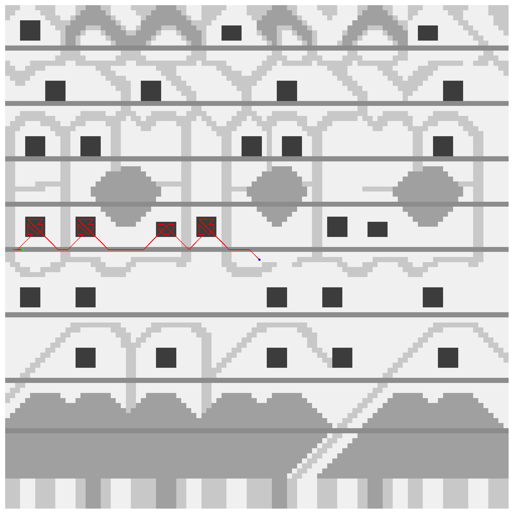

Rust implementation of a path planning algorithm.

# How to run
1. Install [Rust](https://rust-lang.org/tools/install/)
2. Execute `cargo run`
3. Output files are generated in the `output` folder. The `.txt` file contains the details about the found path. On the first row there's the score/value `S` of the path and the length of the path `M`. On the next `M` rows there are the (x, y) coordinates of all the locations that make up the path. The `.png` file shows a representation of the grid, using a greyscale to show the value of the squares: white is zero, black/darkest grey is the highest value on that grid.
3. Configure the algorithm in `config/config.toml`, changing the `N`, `t`, `T`, but also the replenish rate and the algorithm-specific parameters.
4. Pass the `--no-png` flag to not generate the `.png` file; this is useful for big grids because the PNG generation takes a long time
5. Use `--config <path>` to change the configuration file used by the algorithm

Example of PNG of a grid map. The generated path by the algorithm is shown in red, starting from the blue dot, ending at the green dot.
